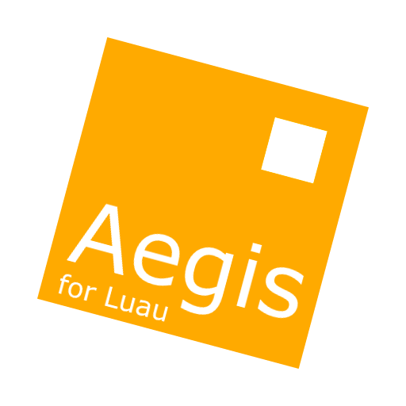

<p align="center">
  <a href="#"></a>
</p>

---

<p align="center">
  <a href="https://github.com/iiDk-the-actual/AegisVM/releases">
    
  </a>
  &nbsp;
  <a href="https://create.roblox.com/store/asset/115970020351857">
    
  </a>
</p>

---

# AegisVM

AegisVM is a complete, sandboxed Luau interpreter written entirely in Luau. It tokenises, parses, and evaluates Luau source code at runtime - no `loadstring`, no `getfenv`, no bytecode injection, no external executors. Everything is manual: a hand-written lexer, a recursive-descent parser with Pratt expression parsing, and an AST-walking runtime.

It runs inside Roblox Studio as a set of ModuleScripts and can be used to execute untrusted or dynamically generated Luau code safely within any game.

---

## Architecture

```
Aegis.luau          (public API - entry point)
├── Lexer.luau      tokeniser, produces a flat token list
├── Parser.luau     recursive-descent + Pratt parser, produces an AST
├── Runtime.luau    AST evaluator / interpreter
├── Scope.luau      lexical scope chain with upvalue semantics
├── StdLib.luau     sandboxed standard library
└── Error.luau      error types and control-flow signal sentinels
```

Source text flows through three stages:

1. **Lexer** - scans the raw source byte-by-byte and emits tokens `{ type, value, line, col }`. Long strings, escape sequences, all Luau operators, and compound assignment are handled.
2. **Parser** - builds an AST from the token stream. Type annotations are parsed and discarded; they have no runtime effect.
3. **Runtime** - walks the AST. `eval()` handles expressions; `execStat()` handles statements. Control flow (`break`, `continue`, `return`, `goto`) is propagated via Lua's own `error()`/`pcall()` mechanism using sentinel signal tables.

---

## Installation

### Via Roblox asset ID

```lua
local Aegis = require(115970020351857)
```

The published asset contains a `MainModule` wrapper that returns the Aegis API directly.

### Via Rojo

Clone the repository and sync into Studio with [Rojo](https://rojo.space):

```bash
git clone https://github.com/iiDk-the-actual/AegisVM.git
cd AegisVM
rojo serve
```

The `default.project.json` places the `Aegis` ModuleScript in `ServerScriptService`. Move it to `ReplicatedStorage` or anywhere else by editing that file before syncing.

### Manual

Copy `src/shared/Aegis.luau` and the `src/shared/Aegis/` folder into Studio as a ModuleScript named `Aegis` with its children placed inside it.

---

## Quick Start

```lua
local Aegis = require(ReplicatedStorage.Aegis)

-- Run code in a fresh, isolated sandbox
local ok, err = Aegis.run([[
    local function factorial(n)
        if n <= 1 then return 1 end
        return n * factorial(n - 1)
    end
    print(factorial(10))   -- 3628800
]])

if not ok then
    warn("Error: " .. err)
end
```

---

## API Reference

### `Aegis.run(source, sourceName?, options?)`

Compiles and runs `source` in a fresh sandbox. Returns `true, ...returnValues` on success or `false, errorMessage` on failure.

```lua
local ok, a, b = Aegis.run([[
    return 1 + 1, "hello"
]])
-- ok = true, a = 2, b = "hello"
```

### `Aegis.newSandbox(options?)`

Creates a reusable sandbox object. Subsequent `runIn` calls share the same global environment.

```lua
local sandbox = Aegis.newSandbox()

Aegis.runIn(sandbox, "x = 100")
Aegis.runIn(sandbox, "print(x)")   -- 100
```

### `Aegis.runIn(sandbox, source, sourceName?)`

Runs source code inside an existing sandbox. Variables persist between calls.

```lua
local sandbox = Aegis.newSandbox()

Aegis.runIn(sandbox, [[
    local total = 0
    for i = 1, 10 do
        total += i
    end
    result = total
]])

Aegis.runIn(sandbox, "print(result)")   -- 55
```

### `Aegis.compile(source, sourceName?)`

Tokenises and parses only; returns `(ast, nil)` on success or `(nil, errorMessage)` on failure. Useful for syntax checking without execution.

```lua
local ast, err = Aegis.compile("local x = ??")
if not ast then
    warn(err)   -- parse error with line/column
end
```

### `Aegis.execAST(sandbox, ast)`

Executes a pre-compiled AST in a sandbox. Combine with `Aegis.compile` when you want to compile once and run many times.

```lua
local ast = assert(Aegis.compile("return math.pi * 2"))

local sandbox1 = Aegis.newSandbox()
local sandbox2 = Aegis.newSandbox()

Aegis.execAST(sandbox1, ast)
Aegis.execAST(sandbox2, ast)
```

### `sandbox.scope:defineGlobal(name, value)`

Injects a host-side value into the sandbox global scope.

```lua
local sandbox = Aegis.newSandbox()
sandbox.scope:defineGlobal("MyAPI", {
    greet = function(name)
        return "Hello, " .. name
    end,
})

Aegis.runIn(sandbox, [[
    print(MyAPI.greet("world"))   -- Hello, world
]])
```

---

## Sandbox Options

```lua
local sandbox = Aegis.newSandbox({
    maxCallDepth = 100,   -- default 200; limits recursion depth
    noStdLib     = false, -- set true to skip standard library population
    globals      = {      -- extra globals injected at construction time
        VERSION = "1.0.0",
    },
})
```

---

## Standard Library

The sandbox provides a safe subset of the Luau standard library. All environment-manipulation functions are excluded.

| Library     | Included                                                                 |
|-------------|--------------------------------------------------------------------------|
| Core        | `print`, `warn`, `tostring`, `tonumber`, `type`, `typeof`, `error`, `assert`, `pcall`, `xpcall`, `select`, `ipairs`, `pairs`, `next`, `rawget`, `rawset`, `rawequal`, `rawlen`, `unpack`, `setmetatable`, `getmetatable`, `loadstring`, `getfenv`, `setfenv` |
| `string`    | Full (`byte`, `char`, `find`, `format`, `gmatch`, `gsub`, `len`, `lower`, `match`, `rep`, `reverse`, `sub`, `upper`, `split`) |
| `table`     | Full (`insert`, `remove`, `concat`, `sort`, `unpack`, `pack`, `move`, `find`, `create`, `clear`, `clone`) |
| `math`      | Full, including Luau extensions (`sign`, `clamp`, `round`)               |
| `bit32`     | Full                                                                     |
| `utf8`      | Full                                                                     |
| `coroutine` | Full                                                                     |
| `task`      | `spawn`, `defer`, `delay`, `wait`, `cancel`                              |
| `buffer`    | Full (Roblox buffer API)                                                 |
| `os`        | `time`, `clock`, `date`, `difftime`                                      |
| Roblox      | `game`, `workspace`, `Enum`, `Instance`, `shared`, `newproxy`, all value-type constructors (`Vector3`, `CFrame`, `Color3`, `UDim2`, etc.) |

**Excluded:** `getfenv`, `setfenv`, `load`, `dofile`, `collectgarbage`, `debug.*`, `io.*`, direct service shortcuts (`Players`, `RunService`, etc. - use `game:GetService()` instead).

---

## Language Features

AegisVM supports the full Luau grammar:

- All expression operators including `//`, `^`, `..`, and bitwise via `bit32`
- Compound assignment: `+=`, `-=`, `*=`, `/=`, `//=`, `%=`, `^=`, `..=`, `&=`, `|=`, `~=`, `<<=`, `>>=`
- Multiple assignment and multiple return values
- Varargs (`...`)
- Closures with correct lexical upvalue semantics
- Metatables and all metamethods (`__index`, `__newindex`, `__add`, `__call`, `__tostring`, etc.)
- Numeric `for`, generic `for` (`pairs`, `ipairs`, custom iterators)
- `while`, `repeat...until`
- `if / elseif / else`
- `break`, `continue`, `goto`, labels
- `do...end` blocks
- Type annotations (parsed and discarded - no runtime effect)
- Method syntax (`obj:method()`)
- String method calls (`("hello"):upper()`)
- Roblox `Instance` property and method access
- `loadstring` - re-compiles source through AegisVM and returns a callable function

---

## Examples

### Closures and upvalues

```lua
Aegis.run([[
    local function counter(start)
        local n = start
        return function()
            n += 1
            return n
        end
    end

    local next = counter(0)
    print(next())   -- 1
    print(next())   -- 2
    print(next())   -- 3
]])
```

### Metatables

```lua
Aegis.run([[
    local Vector = {}
    Vector.__index = Vector

    function Vector.new(x, y)
        return setmetatable({ x = x, y = y }, Vector)
    end

    function Vector:__add(other)
        return Vector.new(self.x + other.x, self.y + other.y)
    end

    function Vector:__tostring()
        return string.format("(%g, %g)", self.x, self.y)
    end

    local a = Vector.new(1, 2)
    local b = Vector.new(3, 4)
    local c = a + b
    print(tostring(c))   -- (4, 6)
]])
```

### Shared sandbox with injected API

```lua
local sandbox = Aegis.newSandbox()

sandbox.scope:defineGlobal("DataStore", {
    save = function(key, value)
        print("Saving", key, "=", value)
    end,
})

Aegis.runIn(sandbox, [[
    DataStore.save("coins", 500)
    DataStore.save("level", 12)
]])
```

### Using `loadstring`

```lua
Aegis.run([[
    local code = "return 2 ^ 10"
    local fn = loadstring(code)
    print(fn())   -- 1024
]])
```

### Checking return values

```lua
local ok, sum, product = Aegis.run([[
    local a, b = 6, 7
    return a + b, a * b
]])

print(ok, sum, product)   -- true  13  42
```

---

## Security Model

AegisVM never calls:

- `getfenv` / `setfenv`
- `loadstring` / `load` at the host level
- Roblox bytecode or internal APIs
- Any external executor or unsafe sandbox escape

Guest code runs entirely within the interpreter's scope chain. It cannot reach the host environment unless the host explicitly injects a value via `defineGlobal`. All execution is manual AST traversal; there is no JIT path, no bytecode compilation, and no native code execution.

---

## License

MIT

---

### AI Disclaimer

This project has used Artificial Intelligence (Claude Sonnet 4.6) to assist with development, design decisions, and documentation drafting.

AI assistance was used as a productivity and engineering aid for tasks such as:

* drafting and refining documentation
* suggesting structural improvements to interpreter components
* generating example usage snippets
* assisting with debugging logic and edge cases
* helping formalize architecture explanations

All generated or suggested content was reviewed, modified, and integrated manually. The final implementation remains the result of human engineering decisions, including control over the lexer, parser, runtime semantics, and sandboxing model.

AI was not used as an autonomous system for producing unchecked code execution paths or for making security-critical decisions without review. Any behavior related to sandboxing, environment isolation, or execution safety was explicitly validated in the context of Luau and Roblox Studio constraints.

This project does not rely on AI at runtime. The interpreter itself is fully deterministic and self-contained, with no external model calls, inference layers, or dynamic code generation from AI systems during execution.

AI tools were used strictly during development time and are not part of the shipped runtime, dependencies, or execution pipeline.